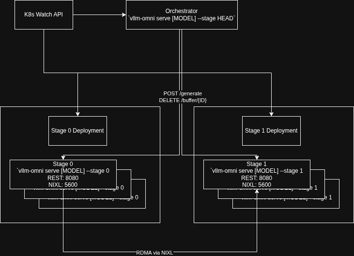

# Kubernetes-Native Architecture for vLLM-Omni

## Key Components

- **Control Plane**: REST API with blocking generation and async cleanup
- **Data Plane**: NIXL over UCX for GPU-to-GPU RDMA transfers. Extensible with other connectors (e.g. Mooncake)
- **Load Balancing**: Manual scheduling by orchestrator using pod IPs from Watch API

## Proposed Design (Kubernetes-native)



### Architecture

Each stage of the pipeline exists as its own Deployment, where each pod serves a single stage of the Omni pipeline. Each pod exposes NIXL (5600) and REST (8080). For RDMA, each pod’s own IP address is injected into itself via an environment variable.

An OpenAI API server acts as the orchestrator, controlling the stage workers: informing them when to start executing and where to get their inputs from as well as when to free outputs buffered in GPU memory. The orchestrator uses the k8s Watch API to monitor pod IPs for each stage/deployment.

### Request Flow

Upon receiving a request from a user client, the orchestrator begins forwarding the request through the pipeline by submitting a POST to one pod per stage sequentially. For the first stage, the orchestrator includes the user inputs in the request. For subsequent stages, the stage worker will return its own IP and a pointer to a buffer in its own memory, which the orchestrator will pass to the next stage to be used for RDMA.

To manage buffered outputs, when a stage responds to the orchestrator’s POST, the orchestrator will send a DELETE `/buffer/{request_id}` to the previous stage letting it know it can free the GPU memory buffering the output of that request. Otherwise, the buffer is garbage collected after a configured timeout.


## Technical Design

Disclaimer: this section was written using AI assistance

### 1. Control Plane: REST API

**Stage Worker HTTP API:**

```python
# POST /v1/generate - Blocking request, returns when processing complete
Request:
{
  "request_id": "req-123",
  "stage_id": 0,
  "data": "base64_encoded_data",  // Only for Stage-0
  "nixl_source_ip": "10.1.2.3",   // Pod IP of previous stage
  "nixl_metadata": {
    "buffer_ptr": 12345678,
    "size": 186000000
  }
}

Response:
{
  "pod_ip": "10.1.2.4",           // This pod's IP
  "nixl_metadata": {
    "buffer_ptr": 87654321,
    "size": 186000000
  }
}

# DELETE /v1/buffers/{request_id} - Non-blocking cleanup
# Query params: from_stage=0&to_stage=1
Response:
{
  "status": "ok"
}
```

**Orchestrator Implementation:**

```python
import httpx
from collections import defaultdict

class K8sOmniOrchestrator:
    def __init__(self):
        self.http = httpx.AsyncClient(timeout=120.0)
        self.stage_pods = defaultdict(list)  # Watch API populates this
        self.rr_index = defaultdict(int)     # Round-robin state

    def _pick_pod(self, stage_id):
        """Manual round-robin load balancing."""
        pods = self.stage_pods[stage_id]
        idx = self.rr_index[stage_id] % len(pods)
        self.rr_index[stage_id] += 1
        return pods[idx]

    async def _process_stage(self, stage_id, request_id, data=None,
                              nixl_source_ip=None, nixl_metadata=None):
        """Blocking POST - waits for stage completion."""
        pod_ip = self._pick_pod(stage_id)

        response = await self.http.post(
            f'http://{pod_ip}:8080/v1/generate',
            json={
                'request_id': request_id,
                'stage_id': stage_id,
                'data': base64.b64encode(data).decode() if data else None,
                'nixl_source_ip': nixl_source_ip,
                'nixl_metadata': nixl_metadata
            }
        )

        return response.json()
```

### 2. Service Discovery: Watch API

Orchestrator discovers pod IPs directly via Watch API:

```python
from kubernetes import client, config, watch

class K8sOmniOrchestrator:
    def __init__(self):
        config.load_incluster_config()
        self.k8s_v1 = client.CoreV1Api()
        self.stage_pods = defaultdict(list)
        asyncio.create_task(self._watch_pods())

    async def _watch_pods(self):
        """Subscribe to pod events for immediate discovery."""
        w = watch.Watch()

        while True:
            try:
                for event in w.stream(
                    self.k8s_v1.list_namespaced_pod,
                    namespace='vllm-omni',
                    label_selector='app=vllm-omni',
                    timeout_seconds=300
                ):
                    await self._handle_pod_event(event)
            except Exception as e:
                logger.error(f"Watch failed: {e}, reconnecting...")
                await asyncio.sleep(5)

    async def _handle_pod_event(self, event):
        event_type = event['type']
        pod = event['object']

        stage_id = pod.metadata.labels.get('stage')
        pod_ip = pod.status.pod_ip

        if event_type == 'ADDED' and pod.status.phase == 'Running':
            self.stage_pods[stage_id].append(pod_ip)
            logger.info(f"Added pod {pod_ip} to stage-{stage_id}")

        elif event_type == 'DELETED':
            self.stage_pods[stage_id].remove(pod_ip)
            logger.info(f"Removed pod {pod_ip} from stage-{stage_id}")
```

**Watch API RBAC:**

```yaml
apiVersion: v1
kind: ServiceAccount
metadata:
  name: omni-orchestrator
---
apiVersion: rbac.authorization.k8s.io/v1
kind: Role
metadata:
  name: pod-watcher
rules:
- apiGroups: [""]
  resources: ["pods"]
  verbs: ["get", "list", "watch"]
---
apiVersion: rbac.authorization.k8s.io/v1
kind: RoleBinding
metadata:
  name: orchestrator-pod-watcher
subjects:
- kind: ServiceAccount
  name: omni-orchestrator
roleRef:
  kind: Role
  name: pod-watcher
```

### 3. Request Lifecycle

The pipeline processes requests through three sequential stages (Thinker → Talker → Code2Wav), with the orchestrator coordinating execution and buffer cleanup.

#### Flow Overview

1. **Client Submission**: Client sends HTTP POST to `/v1/chat/completions`
2. **Stage-0 Processing**: Orchestrator forwards to Stage-0 (text generation), blocks until complete
3. **Stage-1 Processing**: Orchestrator forwards Stage-0 output to Stage-1 (audio codec), blocks until complete
4. **Stage-0 Cleanup**: Orchestrator sends async DELETE to free Stage-0 buffer
5. **Stage-2 Processing**: Orchestrator forwards Stage-1 output to Stage-2 (waveform), blocks until complete
6. **Stage-1 Cleanup**: Orchestrator sends async DELETE to free Stage-1 buffer
7. **Client Response**: Orchestrator returns final result to client

#### Detailed Sequence

| Step | Actor | Action | Result |
|:-----|:------|:-------|:-------|
| 1 | Client | POST /v1/chat/completions | Request queued at orchestrator |
| 2 | Orchestrator | Pick pod via round-robin for Stage-0 | Selected pod: 10.1.2.3 |
| 3 | Orchestrator | POST http://10.1.2.3:8080/v1/generate | Blocking wait (~2s) |
| 4 | Stage-0 Pod | Process text generation | Output stored in GPU buffer |
| 5 | Stage-0 Pod | Return HTTP 200 `{pod_ip, nixl_metadata}` | Orchestrator receives buffer location |
| 6 | Orchestrator | Pick pod via round-robin for Stage-1 | Selected pod: 10.1.2.5 |
| 7 | Orchestrator | POST http://10.1.2.5:8080/v1/generate | Blocking wait (~5s) |
| 8 | Stage-1 Pod | RDMA GET from 10.1.2.3 (NIXL) | Data transferred GPU-to-GPU |
| 9 | Stage-1 Pod | Process audio codec generation | Output stored in GPU buffer |
| 10 | Stage-1 Pod | Return HTTP 200 `{pod_ip, nixl_metadata}` | Orchestrator receives buffer location |
| 11 | Orchestrator | DELETE http://10.1.2.3:8080/v1/buffers/req-123 | Stage-0 buffer freed (async) |
| 12 | Orchestrator | Pick pod via round-robin for Stage-2 | Selected pod: 10.1.2.7 |
| 13 | Orchestrator | POST http://10.1.2.7:8080/v1/generate | Blocking wait (~3s) |
| 14 | Stage-2 Pod | RDMA GET from 10.1.2.5 (NIXL) | Data transferred GPU-to-GPU |
| 15 | Stage-2 Pod | Process waveform generation | Final output generated |
| 16 | Stage-2 Pod | Return HTTP 200 {result} | Orchestrator receives final output |
| 17 | Orchestrator | DELETE http://10.1.2.5:8080/v1/buffers/req-123 | Stage-1 buffer freed (async) |
| 18 | Orchestrator | Stream result to client | Client receives response |

#### Key Characteristics

- **Synchronous stage execution**: Each stage completes before next begins (sequential pipeline)
- **Asynchronous cleanup**: Buffer deletion happens in background, doesn't block pipeline
- **Direct pod addressing**: Orchestrator uses pod IPs from Watch API
- **Delayed cleanup timing**: Buffers freed after next stage completes (not immediately after RDMA)

### 4. Buffer Lifecycle Management

**Orchestrator pipeline with cleanup:**

```python
async def process_pipeline(self, request_id, prompt):
    # Stage-0: Blocking POST
    stage_0_result = await self._process_stage(
        stage_id=0,
        request_id=request_id,
        data=prompt.encode('utf-8')
    )
    # stage_0_result = {'pod_ip': '10.1.2.3', 'metadata': {...}}

    # Stage-1: Blocking POST
    stage_1_result = await self._process_stage(
        stage_id=1,
        request_id=request_id,
        nixl_source_ip=stage_0_result['pod_ip'],
        nixl_metadata=stage_0_result['metadata']
    )

    # Cleanup Stage-0 buffer (async, fire-and-forget)
    await self._cleanup_buffer(
        pod_ip=stage_0_result['pod_ip'],
        request_id=request_id,
        from_stage='0',
        to_stage='1'
    )

    # Stage-2: Blocking POST
    stage_2_result = await self._process_stage(
        stage_id=2,
        request_id=request_id,
        nixl_source_ip=stage_1_result['pod_ip'],
        nixl_metadata=stage_1_result['metadata']
    )

    # Cleanup Stage-1 buffer
    await self._cleanup_buffer(
        pod_ip=stage_1_result['pod_ip'],
        request_id=request_id,
        from_stage='1',
        to_stage='2'
    )

    return stage_2_result
```

**Timeout fallback for reliability:**

```python
class NixlConnector:
    BUFFER_TTL = 300  # 5 minutes

    def _cleanup_stale(self):
        """Background cleanup of orphaned buffers."""
        while True:
            time.sleep(60)

            now = time.time()
            stale = [k for k, (_, ts) in self.buffers.items()
                    if now - ts > self.BUFFER_TTL]

            for key in stale:
                logger.warning(f"Timeout cleanup: {key}")
                self.cleanup(key)
```

### 5. Data Plane: NIXL (GPU-to-GPU RDMA)

**NIXL Connector Overview:**

```python
from nixl._api import nixl_agent, nixl_agent_config

class NixlConnector(OmniConnectorBase):
    supports_raw_data = True

    def __init__(self, pod_ip, nixl_port=5600):
        # Initialize NIXL agent with UCX backend
        agent_config = nixl_agent_config(backends=["UCX"])
        self.nixl_agent = nixl_agent(f"{pod_ip}:{nixl_port}", agent_config)

        # GPU buffer pool (1GB)
        self.pool = torch.empty(1024**3, dtype=torch.uint8, device='cuda')
        self.pool.pin_memory()

        # Buffer tracking
        self.buffers = {}  # key -> (buffer_view, timestamp)
```

**RDMA Transfer Flow:**

```
Stage-0 Pod                    Stage-1 Pod
┌──────────────┐              ┌──────────────┐
│ GPU Memory   │              │ GPU Memory   │
│              │              │              │
│ ┌──────────┐ │              │ ┌──────────┐ │
│ │ Buffer   │ │   RDMA GET   │ │ Buffer   │ │
│ │ (output) │ │◄─────────────│ │ (input)  │ │
│ └──────────┘ │   UCX/RDMA   │ └──────────┘ │
│              │              │              │
│ ptr: 0xABC   │              │ ptr: 0xDEF   │
│ size: 186MB  │              │              │
└──────────────┘              └──────────────┘
       │                             │
       │                             │
   NIXL agent                    NIXL agent
   127.0.0.1:5600               127.0.0.1:5600
``

